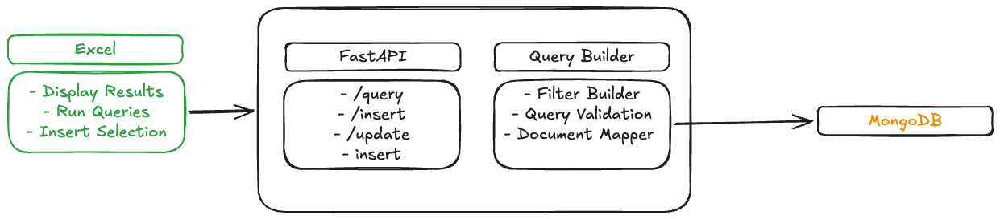

### Features
- Connect to MongoDB
- Select database
- Select collection
- Build filters from Excel
- Execute filtered queries
- Display query results in Excel
- Show "No Results Found" when empty
- Insert selected Excel rows into MongoDB
- Update existing MongoDB records from Excel
- Refresh query results
- Connection health check
### Architecture Diagram


---

### Installation

#### Prerequisites

| Requirement | Version | Notes |
|---|---|---|
| Python | 3.10 + | [python.org](https://python.org) |
| Node.js | 18 + | [nodejs.org](https://nodejs.org) |
| MongoDB | Any | Local or Atlas connection string |
| Microsoft Excel | 365 (subscription) | Desktop, signed-in Microsoft account required |
| mkcert | Latest | For trusted local HTTPS cert |

---

#### macOS

**1. Clone the repo**
```bash
git clone https://github.com/james-may-hammond/excel-mongo.git
cd excel-mongo
```

**2. Python virtual environment + dependencies**
```bash
python3 -m venv .venv
source .venv/bin/activate
pip install -r requirements.txt
```

**3. Node dependencies**
```bash
npm install
```

**4. Create a trusted local SSL certificate**
```bash
brew install mkcert
sudo mkcert -install
mkcert -cert-file cert.pem -key-file key.pem localhost 127.0.0.1 ::1
```

**5. Configure environment**
```bash
cp .env.example .env
# Edit .env — set MONGO_URI and DB_NAME
```

**6. Start the backend**
```bash
./run.sh
```

**7. Load the add-in into Excel**
```bash
# In a second terminal
./node_modules/.bin/office-addin-debugging start fe/manifest.xml --no-debug --dev-server-port 8000
```
Excel opens automatically with the **MongoDB Sync** button in the Home ribbon.

---

#### Windows

**1. Clone the repo**
```cmd
git clone https://github.com/james-may-hammond/excel-mongo.git
cd excel-mongo
```

**2. Python virtual environment + dependencies**
```cmd
python -m venv .venv
.venv\Scripts\activate
pip install -r requirements.txt
```

**3. Node dependencies**
```cmd
npm install
```

**4. Create a trusted local SSL certificate**

Download `mkcert-v*-windows-amd64.exe` from [mkcert releases](https://github.com/FiloSottile/mkcert/releases), rename it to `mkcert.exe`, place it on your PATH, then run in an **Administrator** terminal:
```cmd
mkcert -install
mkcert -cert-file cert.pem -key-file key.pem localhost 127.0.0.1 ::1
```

**5. Configure environment**

Create a `.env` file in the project root:
```
MONGO_URI=mongodb://localhost:27017
DB_NAME=your_database_name
```

**6. Start the backend**
```cmd
.venv\Scripts\activate
python -m uvicorn be.main:app --host localhost --port 8000 --ssl-keyfile key.pem --ssl-certfile cert.pem --reload
```

**7. Load the add-in into Excel**
```cmd
.\node_modules\.bin\office-addin-debugging start fe\manifest.xml --no-debug --dev-server-port 8000
```
Excel opens automatically with the **MongoDB Sync** button in the Home ribbon.